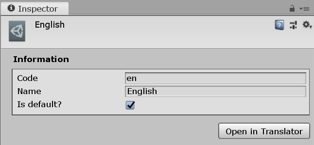
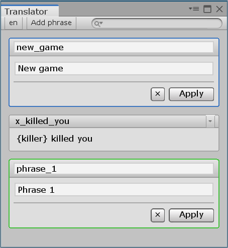
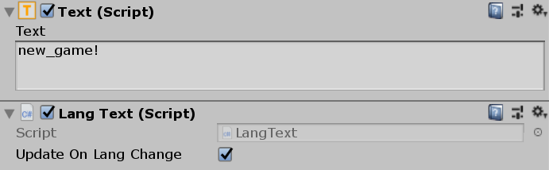
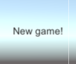

# I18n Unity Package

Some handy tools that help to localise your game!

## Installation

Open `manifest.json` file in `Packages` folder inside your Unity project root.

It will look like that:

```json
{
  "dependencies": {
    ...,
    ...,
    ...
   }
}
```

Add the following line to top of dependencies list:

```json
"com.cmtv.i18n": "https://github.com/CMTV/unity-i18n.git",
```

The result should look like this:

```json
{
  "dependencies": {
    "com.cmtv.i18n": "https://github.com/CMTV/unity-i18n.git",
    ...,
    ...,
    ...
   }
}
```

That is all! Unity will automatically load and install the package!

## Setting up languages

Creating and filling languages in "I18n" is very easy. Just follow these 2 simple steps.

### 1. Creating languages

Create a `Resources/Languages` folder. Right click there and select "Create > I18n > Language". Fill the `Code` and `Name` field in inspector:

* `Code` — an ID of a langauge. Examples: `ru`, `en`, `de`.

Make sure there are no languages with the same ID. Otherwise, all of them except the first one will be skipped.

* `Name` — a display name of language. Examples: `Русский`, `English`, `Deutsch`.

You can optionally mark a language as "Default". If so, it will be used when there is no user-selected language (for example, first game launch).



### 2. Filling languages

Select the language you want to use and hit "Open in Translator" button. This will open a "Translator" editor window. It is empty, yet.

Every language in "I18n" consists of Phrases. A Phrase is just a pair of "Phrase ID" and "Text". You can add phrase by clicking "Add phrase" button. You can also edit/remove existing phrases.



## Usage

### "Language Text" component

The common way to show the text in the game is to use a `UI/Text` component.

"I18n" add a new `UI/Language Text` component. Adding it automatically adds a normal `Text` component too.

The only thing you need to do is to write the prase ID in `Text` component text field. That is all!



Result:



If "Update On Lang Change" selected the text will be automatically updated when the language changes.

### Direct call

To get the phrase text by its ID with the following code:

```csharp
string text = Lang.Phrase("new_game"); // New game
```

You can call `Lang.Phrase(...)` from every scene of you game. No further actions required!

You can freely add punctuation the following punctuation symbols to the and of phrase ID:

`.` `...` `:` `;` `!?` `?!` `!` `?`

```csharp
string text = Lang.Phrase("new_game?!"); // New game?!
```

Moreover, you can pass "key-value" data to the phrase. In this case all strings of `{key}` format in phrase text will be replaced with corresponding dictionary values.

```csharp
var phraseParams = new Dictionary<string, string>
{
    { "killer", "Crazy1998" } // This means replace all "{killer}" with "Crazy1998" 
};

string text = Lang.Phrase("x_killed_you!", phraseParams); // Crazy1998 killed you!
```

### Changing the language

To change the language, simply call `Lang.Switch(...)` method and provide a target language code as argument. Example:

```csharp
Lang.Switch("ru"); // Switching to Russian language
```

You may also add listeners to `onLanguageSwitch` event and write custom actions when the language changes.

### Available languages

To get the list of available languages, call `Lang.GetLangs()` method. It returns an array of `LanguageInfo` structs.

```csharp
LanguageInfo[] langInfos = Lang.GetLangs();

foreach (var langInfo in langInfos)
{
    Debug.Log(langInfo.Code + " " + langInfo.Name); // en English // ru Русский // de Deutsch
}
```